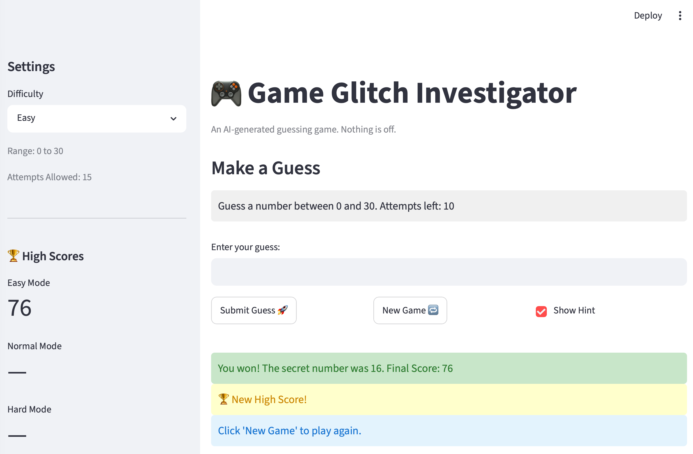
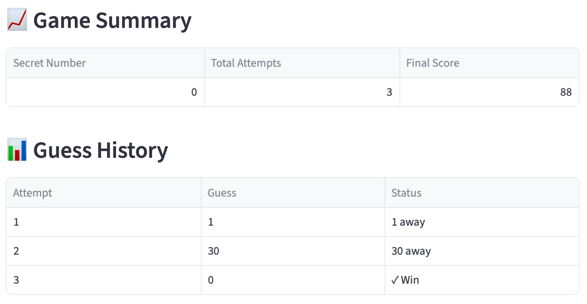

# 🎮 Game Glitch Investigator: The Impossible Guesser
## 🚨 The Situation
You asked an AI to build a simple "Number Guessing Game" using Streamlit.
It wrote the code, ran away, and now the game is unplayable. 

- You can't win.
- The hints lie to you.
- The secret number seems to have commitment issues.

## 🛠️ Setup
1. Install dependencies: `pip install -r requirements.txt`
2. Run the broken app: `python -m streamlit run app.py`

## 🕵️‍♂️ Your Mission
1. **Play the Game** Open the "Developer Debug Info" tab in the app to see the secret number. Try to win.

2. **Find the State Bug** Why does the secret number change every time you click "Submit"? Ask ChatGPT: *"How do I keep a variable from resetting in Streamlit when I click a button?"*

3. **Fix the Logic** The hints ("Higher/Lower") are wrong. Fix them.

4. **Refactor & Test**
   - Move the logic into `logic_utils.py`.
   - Run `pytest` in your terminal.
   - Keep fixing until all tests pass!

## 📝 Document Your Experience
- Describe the game's purpose.
   - The purpose of the game is to guess a secret number within a given range.

- Detail which bugs you found.
   - The initial bugs I found include:
      - Hints are not accurate.
      - When you guess the secret number, the score you get doesn't match the score shown in the developer debug info.
      - The game no longer works when you press new game.
      - The range never changes when you change your difficulty.
      - When you press submit guess for the first time, it only lowers your attempts, only when you press it a second time does it actually submit your guess.
      - Attempts are not accurate.

- Explain what fixes you applied.
   - The fixes the AI and I applied include:
      - Hints now display accurately.
      - Scores now match correctly.
      - A new game starts when you press new game.
      - Every difficulty has a different range.
      - When you press submit guess, everything updates at once.
      - Attempts now display accurately.

## 📸 Demo Walkthrough
Describe your fixed game in numbered steps so a reader can follow along without watching a video:

1. User submits a guess of 1.
2. Game returns "📈 Go HIGHER!" and "Cold ❄️"
3. Score updates.
4. User submits a guess of 30.
5. Game returns "📉 Go LOWER!" and "Cold ❄️"
6. Score updates.
7. User submits a guess of 20.
8. Game returns "📉 Go LOWER!" and "Hot 🔥"
9. Score updates.
10. User submits a guess of 10.
11. Game returns "📈 GO HIGHER!" and "Warm 🌡️"
12. Score updates.
13. User submits a guess of 16.
14. Game ends with the "You won! The secret number was 16. Final Score: 76" message.
15. If that was a new high score, it gets displayed under "🏆 High Scores," with the "🏆 New High Score!" message.
16. "Click 'New Game' to play again."

**screenshot** *(optional)*:
> 

## 🧪 Test Results
```
tests/test_game_logic.py
========================= 26 passed in 0.03s =========================
```

## 🚀 Stretch Features
- If you choose to complete Challenge 4, describe the Enhanced UI changes here — a screenshot is optional.
   - There are now:
      - Hot and Cold Hints
      - Color Coding
      - Game Summary
      - Guess History
      - High Scores Sidebar

   - Screenshots:
      - The High Scores Sidebar can be seen from the screenshot under "📸 Demo Walkthrough."
      - 
      - 
      - 
